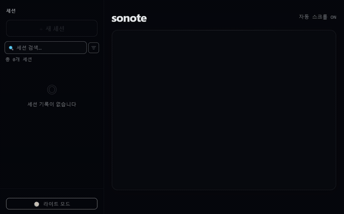

<p align="center">
  <picture>
    <source media="(prefers-color-scheme: dark)" srcset="https://raw.githubusercontent.com/tellang/sonote/main/static/logo-dark.svg">
    <source media="(prefers-color-scheme: light)" srcset="https://raw.githubusercontent.com/tellang/sonote/main/static/logo-light.svg">
    
  </picture>
</p>

<h1 align="center">sonote</h1>

<p align="center">
  <strong>Beyond Transcription, Toward Meeting Intelligence.</strong><br>
  Real-time Korean STT engine built for AI agents and professional meetings.
</p>

<p align="center">
  <a href="https://pypi.org/project/sonote"></a>
  <a href="https://pypi.org/project/sonote"></a>
  <a href="https://pypi.org/project/sonote"></a>
  <a href="https://github.com/tellang/sonote/actions"></a>
  <a href="https://github.com/tellang/sonote/stargazers"></a>
  <a href="LICENSE"></a>
</p>

<p align="center">
  <a href="docs/GUIDE.md">Documentation</a> ·
  <a href="docs/GUIDE.md#getting-started">Getting Started</a> ·
  <a href="docs/SPEAKER_DIARIZATION_RESEARCH.md">Research</a> ·
  <a href="https://github.com/tellang/sonote/issues">Issues</a>
</p>

---

## Demo

<p align="center">
  
</p>

## Installation

```bash
pip install sonote
```

<details>
<summary>기타 설치 방법</summary>

```bash
# pipx (격리 설치)
pipx install sonote

# 소스에서 설치
git clone https://github.com/tellang/sonote && cd sonote
uv sync
```

</details>

> [!NOTE]
> ffmpeg 필수: `choco install ffmpeg` (Windows) / `brew install ffmpeg` (macOS)
> 화자 분리: `pip install sonote[diarize]` + `HF_TOKEN` 환경변수

## Quick Start

```bash
# 회의 실시간 전사 (Viewer: http://localhost:8000)
sonote meeting

# YouTube 라이브 올인원 (스캔 → 병렬 다운 → 변환 → 병합)
sonote auto <VIDEO_URL>

# 로컬 오디오 변환
sonote transcribe audio.wav
```

## Commands

| Command | Description |
|---------|-------------|
| `sonote meeting` | 마이크 → 화자 분리 → SSE 자막 + 파일 저장 |
| `sonote auto <URL>` | YouTube 올인원 (BGM 자동 분류, 병렬 다운로드, 변환, 병합) |
| `sonote live <URL>` | YouTube 연속 실시간 변환 |
| `sonote transcribe <FILE>` | 로컬 오디오/영상 변환 |
| `sonote detect <URL>` | BGM↔음성 경계 탐색 |
| `sonote download <URL>` | YouTube 오디오 다운로드 |

<details>
<summary>주요 옵션</summary>

```bash
# 긴 파일 청크 분할
sonote transcribe long.wav --chunk-minutes 10

# SRT 자막 출력
sonote transcribe audio.wav --fmt srt

# 기존 스크립트에 이어붙이기
sonote auto "URL" --resume transcript.txt

# 마이크 장치 선택
sonote meeting --list-devices
sonote meeting --device 1

# 화자 분리 비활성화
sonote meeting --no-diarize
```

</details>

## Key Features

- **Zero-Latency Tracking** — 마이크 입력과 YouTube 라이브를 최소 지연으로 실시간 추적
- **Intelligent Diarization** — 미등록 화자 임베딩 추적, 5개+ 세그먼트 누적 시 자동 등록 후보 마킹
- **Professional Viewer** — 단일 HTML 웹 인터페이스, 다크/라이트 모드, 실시간 검색
- **AI-Driven Refinement** — LLM 연동 회의 요약 및 스크립트 교정 (Codex STT + Gemini 요약)
- **Real-time API** — SSE + WebSocket 양방향 통신, 자동 재연결, 세션별 검색 API

## Performance

| Model | RTF (Speed) | CER (Accuracy) | VRAM |
| :--- | :--- | :--- | :--- |
| **large-v3-turbo** (default) | **< 0.05** | ~16.4% | ~3.5 GB |
| large-v3 | ~0.12 | **~11.2%** | ~6.0 GB |
| small | < 0.02 | ~22.8% | ~1.5 GB |

> [!TIP]
> NVIDIA RTX 4070+ 환경에서 CUDA float16 최적화. RTF 0.05 미만으로 실시간 이상 속도.

<details>
<summary>API & WebSocket</summary>

### Search API

```bash
# 키워드 검색
curl "http://127.0.0.1:8000/api/sessions/{session_id}/search?query=회의"

# 화자 + 시간 범위 필터
curl "...?query=결정&speaker=김팀장&time_start=300&time_end=1200"

# 정규식 검색
curl "...?query=일정|마감&regex=true"
```

### WebSocket

`WS /ws/transcribe` — 전사/교정/세션 이벤트 양방향 통신. SSE 폴백, 30초 하트비트, 자동 재연결.

### Speaker Auto-Registration

| Endpoint | Method | Description |
|----------|--------|-------------|
| `/api/speakers/unknown` | GET | 미등록 화자 목록 |
| `/api/speakers/auto-register` | POST | 미등록 화자 프로필 등록 |
| `/api/speakers/unknown/{id}` | DELETE | 미등록 화자 무시 |

</details>

<details>
<summary>Build & Benchmark</summary>

```bash
# Windows EXE 패키징
uv run python scripts/build.py --onefile

# 모델 벤치마크
uv run python scripts/benchmark_models.py --models small large-v3-turbo
```

</details>

## Project Structure

```text
src/
├── cli.py            # CLI 진입점
├── server.py         # FastAPI SSE + WebSocket
├── transcribe.py     # Faster-Whisper 추론 코어
├── diarize.py        # 화자 분리 (pyannote-audio)
├── download.py       # YouTube 오디오 다운로드
├── continuous.py     # 연속 실시간 변환
├── polish.py         # LLM 후처리 (실시간 교정 + 종료 후 일괄)
└── whisper_worker.py # CUDA 격리 STT 워커
static/
└── viewer.html       # 자막 뷰어 (단일 HTML)
```

## Documentation

Full command references, architecture, and troubleshooting: **[User Guide](docs/GUIDE.md)**

---

<div align="right">

**Copyright (c) 2025 Tellang**
Licensed under the [MIT License](LICENSE).

</div>
